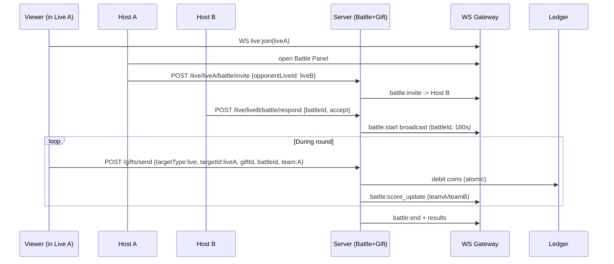

# Live Battle (MVP) — Ecrane + Conexiuni + API + Realtime

Document de produs/tehnic pentru iOS / Android / Web. Conține flow-ul UX, evenimentele realtime, endpoint-urile și modelul de date minimal.

## 1) Live Battle (MVP) — ce include

### Ecrane (UI)
- Live Room (Viewer)
  - buton Battle (vizibil la host / moderator)
  - overlay scoreboard (Host A vs Host B)
  - timer (ex: 3 min round)
  - gift button (trimite puncte către host selectat)
  - chat + hearts
- Go Live (Host)
  - toggle: Allow battles
- Battle Panel (Host)
  - Find opponent / Invite
  - listă Online hosts (MVP simplu)
  - accept/decline
- Battle Match Screen (pre-round)
  - countdown 3..2..1
- Battle Result Screen
  - winner, total coins, top gifters, rematch

### Reguli Battle (MVP simple)
- Battle score = sumă puncte din gifts în fereastra round-ului
- 1 gift = X points (map din catalog)
- Round: 180s, cooldown 30s
- Rematch + Exit battle

## 2) UX Flow (battle + intrări)

```mermaid
flowchart TB
  subgraph ENTRY[Entry points]
    H[Home/Feed]
    D[Discover]
    P[Profile]
  end

  subgraph LIVE[Live]
    LVR[Live Room Viewer]
    GL[Go Live (Host setup)]
    LHR[Live Host Room]
    BP[Battle Panel]
    PR[Pre-round]
    RUN[Battle Round Running]
    RES[Battle Results]
  end

  H --> LVR
  D --> LVR
  P --> LVR
  H --> GL --> LHR
  D --> GL
  P --> GL

  LHR --> BP
  BP --> PR --> RUN --> RES
  RES --> BP
  RES --> LHR
```

## 3) Realtime events (WebSocket)

### Battle
- `battle:invite` (hostA → hostB)
- `battle:accept` | `battle:decline`
- `battle:start` (server broadcast)
- `battle:score_update` (server broadcast, la fiecare gift sau periodic)
- `battle:end` (server broadcast)

### Live core
- `gift:sent` (viewer → server → broadcast)
- `chat:message`
- `hearts:tap` (rate-limited)

### Anti-spam / rate limits (MVP)
- hearts: tap rate-limit per device/user
- chat: messages/min per user
- gifts: requests/min + ledger idempotency

## 4) Backend logic (important)

### Battle Service (în Live Orchestrator sau separat)
- creează battle session
- validează round state (start/end)
- calculează scor din gifts (din ledger/events)
- aplică rate limit + anti-spam

### Gift Service + Wallet Ledger
- debit atomic coins
- produce event `gift_sent` cu metadata:
  - `targetType=live`, `targetId=liveId`
  - `battleId` (optional)
  - `team` (hostA/hostB sau `liveA/liveB`)

## 5) API endpoints (schelet clar)

### Live base
- `POST /live/create`
- `POST /live/join`
- `POST /live/leave`

### Battle (nou)
- `POST /live/:liveId/battle/invite` body: `{ opponentLiveId }`
- `POST /live/:liveId/battle/respond` body: `{ battleId, action: "accept" | "decline" }`
- `POST /live/:liveId/battle/start` body: `{ battleId }` (sau auto la accept)
- `POST /live/:liveId/battle/end` body: `{ battleId }`
- `GET /live/:liveId/battle/:battleId` (state + score + timer)

### Gifts (live + battle aware)
- `POST /gifts/send`
  - body: `{ targetType:"live", targetId: liveId, giftId, battleId?, team? }`

## 6) Data model (minim)

### Live session
```txt
LiveSession {
  id
  hostUserId
  status
  providerRoomId
  viewerCount
  allowBattles (bool)
}
```

### Battle session
```txt
BattleSession {
  id
  liveAId
  liveBId
  status (invited|accepted|running|ended|cancelled)
  startAt
  endAt
  cooldownUntil?
}
```

### Score
- Variantă A (simplă): stocare “rolling score”
```txt
BattleScore { battleId, teamA, teamB, updatedAt }
```
- Variantă B: scor calculat la runtime din events (mai corect, mai greu)

### Gift transaction (ledger-linked)
```txt
GiftTxn {
  id
  fromUserId
  toUserId
  liveId
  battleId?
  team?
  giftId
  coins
  createdAt
}
```

## 7) Flow tehnic (one-glance)

```mermaid
flowchart LR
  subgraph UI[UI]
    LVR[Live Viewer Room]
    LHR[Live Host Room]
    BP[Battle Panel]
  end

  subgraph API[API]
    LIVEAPI[POST /live/create|join|leave]
    BAPI[POST /live/:id/battle/*\nGET battle state]
    GAPI[POST /gifts/send]
  end

  subgraph RT[Realtime]
    WS[WebSocket Gateway]
    PUB[(PubSub)]
  end

  subgraph MONEY[Wallet]
    LEDGER[(Ledger atomic)]
  end

  subgraph LIVEP[Live Provider]
    PROV[Agora/LiveKit/Mux]
  end

  LHR --> LIVEAPI --> PROV
  LVR --> LIVEAPI --> PROV
  BP --> BAPI

  LVR --> GAPI --> LEDGER
  GAPI --> PUB --> WS
  BAPI --> PUB --> WS
  WS --> LVR
  WS --> LHR
```

## 8) “Restul” Live features (TikTok-like) — MVP + ordine

### 1) Multi-guest (co-host / guests)
- MVP: host invită 1 guest (max 2)
- UI: Invite guest, grid 2-up
- WS: `guest:invite`, `guest:accept`, `guest:joined`, `guest:left`
- Endpoints:
  - `POST /live/:liveId/guest/invite`
  - `POST /live/:liveId/guest/respond`
  - `POST /live/:liveId/guest/kick`

### 2) Moderators
- MVP: host poate seta 1–3 mod
- perms: mute chat user, block user, delete msg
- Endpoint:
  - `POST /live/:liveId/mods/add`
  - `POST /live/:liveId/mods/remove`
- WS: `mod:action`

### 3) Live Rankings
- Top gifters (per live) + Top gifters (per battle round)
- `GET /live/:liveId/leaderboard`
- WS: `leaderboard:update`

### 4) Gifts combos / streak (simplu)
- dacă user trimite cadouri repetate în 10s → combo xN
- WS: `gift:combo`

### 5) Live schedule (optional)
- `POST /live/schedule`, `GET /live/scheduled`

### 6) Safety minim (obligatoriu)
- report live / block user
- rate limits chat/hearts/gifts attempts
- basic keyword filter

## 9) Schiță rapidă (Live Battle flow)



## 10) Notă pentru echipă
- UI primitives: overlay (score/hearts/gift anim), sheets (gift), modal (report), panel (battle).
- “MVP realist”: nu construiești streaming; îl conectezi prin provider.

